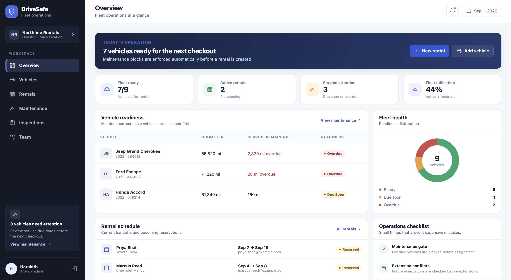
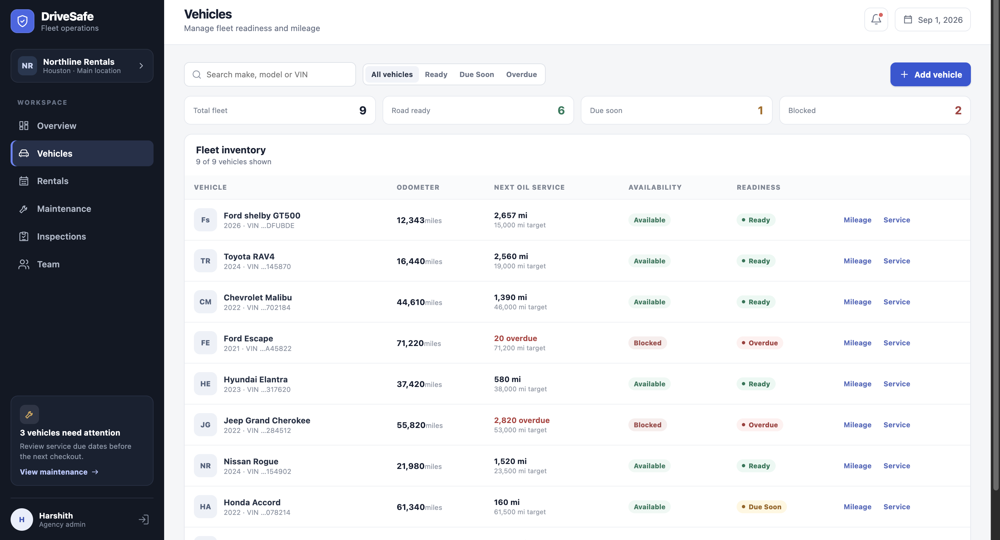
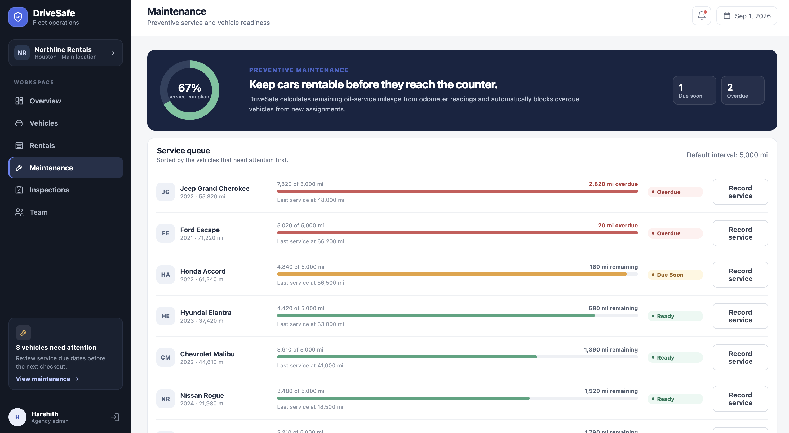
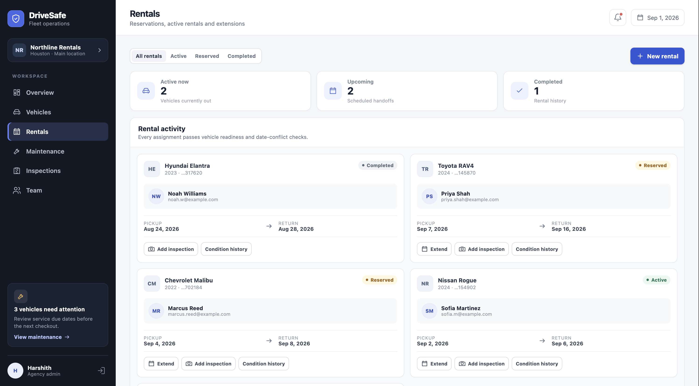
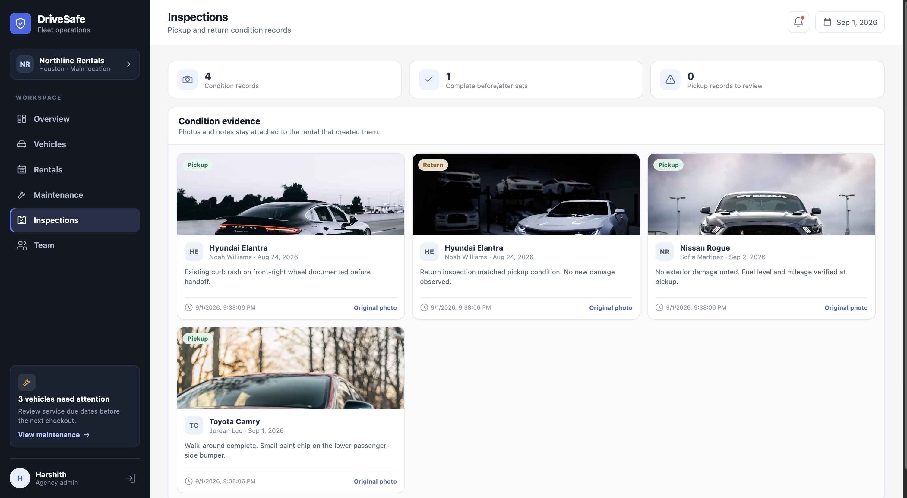
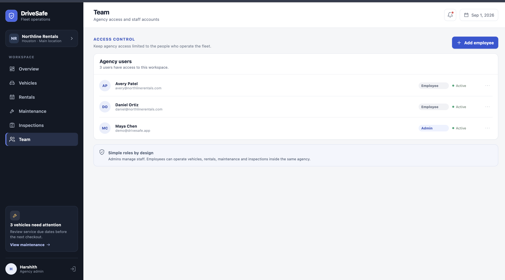

# DriveSafe

DriveSafe is a rental fleet operations app built for small and independent car rental agencies.

The idea came from problems I personally faced while renting cars.

On a few trips, I picked up vehicles that started showing oil or service warnings shortly after leaving the rental location. That meant contacting the rental company, visiting a service partner, or swapping the car during the trip.

I also faced another issue. Existing scratches or damage were not always properly documented before pickup. After returning the vehicle, it could become difficult to prove whether the damage was already there.

That is what gave me the idea for DriveSafe.

The main goal is simple:

**Make sure a vehicle is actually ready and properly documented before it is handed to a customer.**

---

## What DriveSafe Does

DriveSafe helps rental agency staff manage vehicle readiness, rentals, maintenance, and inspections in one place.

A vehicle may be available, but that does not always mean it is ready to be rented.

For example, it may:

- be overdue for maintenance
- be approaching its service interval
- be missing a pickup inspection
- have another reservation that conflicts with an extension

DriveSafe checks these situations as part of the rental workflow.

---

## Dashboard

The dashboard gives staff a quick view of current fleet operations.

It shows:

- total vehicles
- vehicles ready for rental
- vehicles due for service
- overdue maintenance
- active rentals
- upcoming returns
- operational alerts



---

## Vehicle Readiness

Each vehicle stores its mileage and maintenance information.

DriveSafe calculates a vehicle status such as:

- `READY`
- `DUE SOON`
- `OVERDUE`

If a vehicle is overdue for maintenance, it should not be assigned to a customer until the required service is completed.



---

## Maintenance Tracking

The maintenance section helps staff see which vehicles need attention.

It shows:

- current mileage
- last service mileage
- service interval
- miles remaining before service
- maintenance status

The goal is to identify maintenance issues before the customer discovers them during a trip.



---

## Rental Management

DriveSafe keeps track of active, upcoming, and completed rentals.

It also checks rental extensions.

For example, if a customer wants to keep a vehicle longer, the system checks whether another reservation already exists for that vehicle.

If there is a conflict, the extension should not be approved.



---

## Pickup and Return Inspections

Before a vehicle is handed to a customer, its condition can be documented with photos and notes.

The return condition is recorded separately.

This creates a clear before-and-after record for the same rental.

The goal is to protect both sides:

- customers should not be blamed for damage that was already present
- rental agencies should have evidence when new damage occurs



---

## Team Management

DriveSafe supports two main roles:

### Admin

Admins can manage:

- agency users
- employees
- vehicles
- operational data

### Employee

Employees can work with:

- rentals
- inspections
- mileage updates
- day-to-day fleet operations



---

## Architecture

I kept the architecture small and focused.

The backend is split into three Spring Boot services:

### Auth Service

Handles:

- authentication
- JWT tokens
- agency users
- Admin / Employee roles

### Vehicle Service

Handles:

- vehicle records
- mileage
- maintenance information
- vehicle readiness

### Rental Service

Handles:

- rentals
- rental extensions
- reservation conflicts
- pickup inspections
- return inspections

The React frontend communicates with these services through REST APIs.

```text
                    React
                      |
        -----------------------------
        |             |             |
   Auth Service  Vehicle Service  Rental Service
        |             |             |
        ----------- MySQL -----------